

  

Jessica Mouras

 [slides](https://docs.google.com/presentation/d/1tSodmQ48ZsKshlh6qND1ztkpaNNiycca4L9i5k-KV8E/edit?usp=sharing) **|** [github](https://github.com/jessicapmouras/fraud_detect) **|** [linkedin](https://www.linkedin.com/in/jessicamouras/)
 
 ## Table of Contents
[1. Motivation](#motive)  
[2. Data](#data)
>   [i. Pipeline](#pipeline) 
    [ii. Intro to Fraud](#intro) 
    [iii. Unbalanced Datasets](#unbalanced) 
    
[3. Methods](#mlclass) 
> [i. Undersampling](#undersample) 
> [ii. SMOTE](#smote) 

[4. Anomaly Detection Techniques](#technique) 
> [i. Isolation Forest](#isolation) 
> [ii. PCA Anomaly Detection](#pca) 
> [iii. Neural Network Autoencoder](#auto) 

[5. Conclusion & Further Application](#conclude) 
> [i. References](#references) 

## Motivation

I started my career in financial services As a CPA (license still current, but inactive) who found the gritter aspects of accounting and finance most intriguing. In fact, my first consulting project ever was an Anti Money Laundering (AML) assignment that deployed Machine Learning techniques, but was 2012 and I was a very junior employee. 

I wanted to revisit the topic of money laundering by building methods and models to assist with identifying fraudulent transactions.

Here, I assess a large dataset of credit card transactions over 2 days in September 2013 of European cardholders to classify the transactions between fraud and non-fraud. As discussed below, by doing this classification, I am detecting anomalies. Through my analysis, I hope to determine which methods are best for detecting fraudlent transactions.

## Data

As discussed briefly above, this dataset contains transactions made by European credit holders cards in September 2013 over the coure of two days. The minority class is  492 frauds out of 284,807 transactions which is 0.172% of all transactions. Therefore, the majority class is 99.827% of transactions.

The following had already been done to the data to anonymize the information except for time and amount:

+ PCA Transformation:  the features went through a PCA transformation (Dimensionality Reduction technique) which creates latent features that are some combination of the original features of the data. 

+ Scaling: The data has already been scaled as in order to perform PCA, one must scale the features prior to transformation.

I separately scaled time and amount to perform the remainder of this analysis.

Due to the anonymization process, the feature names, descriptions, and nature is largely undisclosed. I reviewed the features for data-leakage and potential rank issues (where a feature is a transformation of another feature and therefore redundant). Note: during the EDA process, I did not choose to select outliers to remove, as they could be possible important transactions to review during the anomaly classification process.

### Pipeline

To perform my analysis I used the following libaries:

  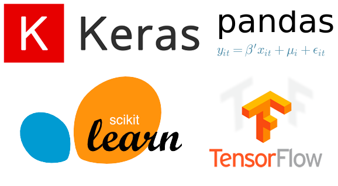

The data was already classified as 1 - the class for fraudulent transaction and 0 - the class for normal transactions. Throughout this analysis I will refer to predicting a fraud instance correctly to be considered a true positive.

### Introduction to Fraud

There are many types of financial fraud and many subsets of Money Laundering. In the course of this notebook, we will only be addressing the concept of Money Laundering through a Retail Banking Institution. Also known as: Credit Card Fraud.

>*Credit card fraud is the unauthorized use of a credit or debit card, or similar payment tool (ACH, EFT, recurring charge, etc.), to fraudulently obtain money or property.* - **Federal Bureau of Investigation**

Disclaimer: the methods deployed in this notebook may not be applicable or appropriate for other types of Money Laundering e.g. through an Investment Bank / Private Equity Fund, etc.

### Unbalanced Datasets

Unbalanced data in terms of a classification models means that there is proportionally more of one class (taget) than the other. This is an issue because what happens during training and deployment of machine learning classifiers is  that there are not enough examples of the minority class for a model to effectively learn the "decision boundary".

All models will struggle on new or true testing data as they just didn't have enough evidence and "coaching" to learn the difference!

There are two ways to attempt to solve this issue:

1. Undersampling
2. Oversampling
3. Other Techniques: Anomaly Detection

**Undersampling**

We find out how many instances are in the minority class,  fraudulent transactions in this case.
Then we need to make a new data set that is a randomized (shuffled) subsample of the majority class, normal transactions, to the same amount as fraud transactions. This creates an even, balanced data set of 50% of each class (for binary classification such as fraud vs not fraud. For this dataset that means we limit our original dataset to be 492 cases of fraud and 492 cases of normal transactions.

Warning: This methodology of undersampling comes at a relatively large price. The original data set was approximately 284,000 transactions, and now it has been reduced to 984.There is a risk that a classification model will not perform well since there is large volumes of general information loss.

One way to solve this information loss issue brings us to our other option:

**Oversampling**

You want to oversample instances the minority class. How do we oversample something that doesn't exist? 

**a.** Make copies of exact samples from the minority class in the training dataset prior to fitting a model. Rather simplistic and doesn't actually assist in information gain like actual new data would provide.

**b.** Synthesize new instances from the minority class. This methodology is called Synthetic Minority Oversampling TEchnique, or SMOTE for short. This technique was described by Nitesh Chawla, et al. in their 2002 paper named for the technique titled “SMOTE: Synthetic Minority Over-sampling Technique.”

**Anomaly Detection Techniques**

*Isolation Forest*: A random tree based ensemble method that works to isolate anomaly values through a supervised or unsupervised classifier. Anomalies are the ponts with the shortest average path length. There is no profiling of normal instances nor is there any point based calculations.

*Auto-encoders*: A form of unsupervised learning where we measure how “far” the reconstructed data point provived by the model is from the actual, original datapoint. If the error is large, then the original datapoint is likely an anomaly. Here we used 2 methods to create autoencoders:
+ an unsupervised PCA transformation that transforms the feature space data via linear compression and reconstruction.
+ an unsupervised neural network that transforms the data via nonlinear compression and reconstruction.

## Methods

The methods addressed during this analysis are as follows:

**Undersampling and Machine Learning Classification Models:**
+ Logistic Regression
+ kNN Classifier
+ Decision Trees Classifier
+ Random Forest Classifier
+ Gradient Boosted Classifier

**Oversampling:**
+ Discussion of Synthetic minority over-sampling technique (SMOTE)

**Anomaly Detection for Unbalanced Classes:**
+ Isolation Forest
+ PCA Anomaly Detection
+ Neural Network Autoencoder

### Undersampling

To undersample and create balanced classes within my dataset. I had to reduce my original data to double the amount of the minority class. As there were 492 fraud transactions, I shuffled the remainder of the data and selected 492 random non-fraud transactions. In total, the undersampled dataset size is now 984 transactions. The information lost from the original transaction is 99.7%. Not good at all. That is a signifcant amount of loss just to create an inital data population. I decided to not remove any of the features and continue with standardized data as described above.

  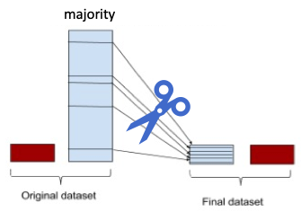

Despite all of the information loss and troubling aspects of undersampling in this manner, I wanted to see what sort of results I would achieve with classification on this reduced data. Ultimately, I wanted to see if the evaluated models during undersampling serve either oversampled or original data in future analysis.

I evaluated the following models on the undersampled data:

+ Logistic Regression
+ kNN Classifier
+ Decision Trees Classifier
+ Random Forest Classifier
+ Gradient Boosted Classifier

As shown here by the ROC Curve below, the models' performance on cross validated undersampled data was quite good. The best performing models were Logistic Regression and Gradient Boosted Classifier. I chose these to deploy on the original dataset testing population to evaluate performance of a model trained on a balanced, but severely undersampled subsample.

  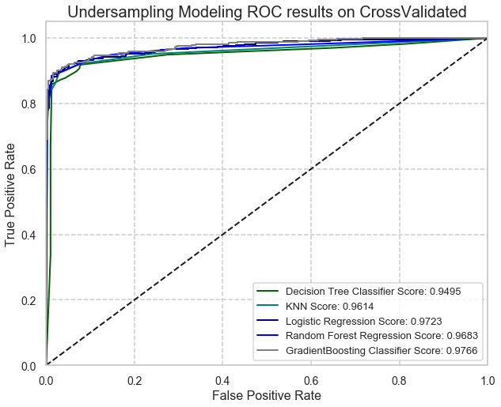

As I am looking to perform a binary classification, my most important metrics to evalute are:
+ Precision: is the fraction of correct positives (in this case fraud instances) among the total predicted positives. It is also called the accuracy of positive predictions. 

+ Recall: is the fraction of correct positives among the total positives in the dataset. It is indicating how many total positives of the actual dataset were covered(classified correctly) while doing prediction.

The [precision - recall tradeoff](https://www.machinelearningaptitude.com/topics/machine-learning/what-is-precision-recall-tradeoff/) strategy depends on the practical application assessed. A binary classifier will always miss classify some datapoints if provided enough information/ data over time. The incorrect classification rate is either compromising the precision or recall scores.

In the case of this assessment of fraud detection. Recall is more important than precision, as you would like to have less False Negatives (fraud instances labeled normal transactions and therefore missed anomalies) in trade off to have less False Positives (normal instances labeled as fraud).

Meaning, getting a False Negative (missing a fraudulent transaction) is very costly:
+ Financial loss (actual fraud amount, insurance premiums/coverage, losing customers to competitor with better security)
+ Reputation loss (Wachovia bank is a good example of a tarnished reputation and ultimate demise)

And conversely, a False Positive (spending some time investigating a normal transaction) is not as costly:
+ Salary rate of individual investigating the transaction
+ Some customer interaction for a false alarm, small customer frustration

Deploying the best performing classification models on the original dataset, the results display why this method isn't sufficient for detecting fraud.

While the accuracy scores are quite high, upon further assessment it appears that the models are just predicting the majority class, but ultimately are failing to catch the fraud instances.

  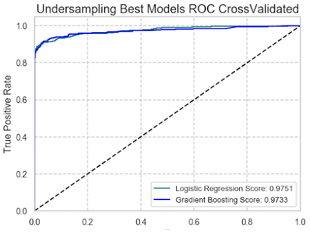

  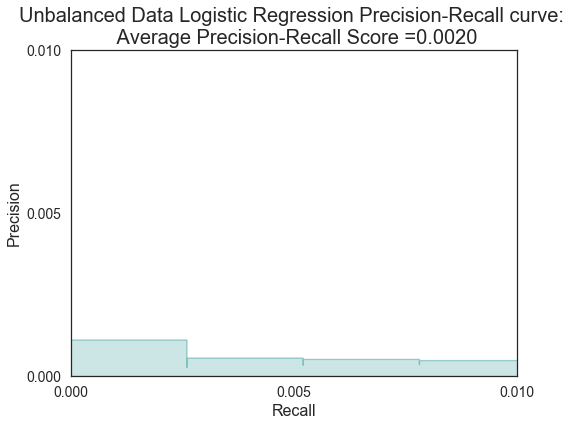

  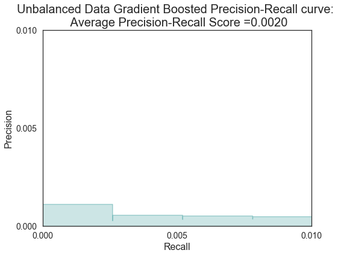

### Oversampling (SMOTE)

Synthetic minority over-sampling technique (SMOTE) is an oversampling technique that selects instances close to each other in the existing dataset's feature space. It then "draws" a line between the instances selected and adds new sample at a point somwhere along that line.

To put this into a perspective we can digest using machine learning methods and terms to define the steps:

Step 1) a random instance from the minority class is first chosen.
Step 2) k of the nearest neighbors for that example are found (typically k=5).
Step 3) a randomly selected "neighbor" is chosen.
Step 4) finally, a synthetic example is created at a randomly selected point between the two examples in feature space.

That is a lot of randoms!

Why does this work? Well, "new synthetic" instances from the minority class that are generated through this process  are generally speaking close in feature space to existing examples from the minority class.

  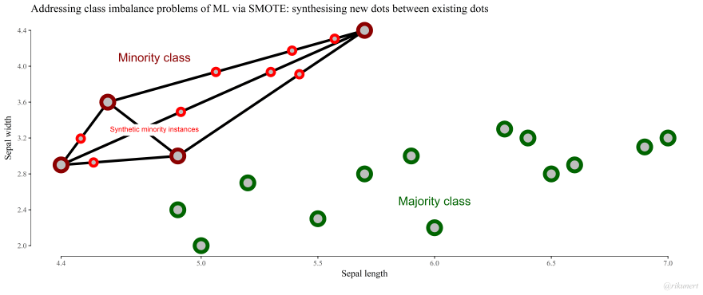

**WARNING:** This technique must be executed correctly to retain the original integrity of the class distribution of the original dataset. This process must be peforming during, **not** before the cross validation process. 

  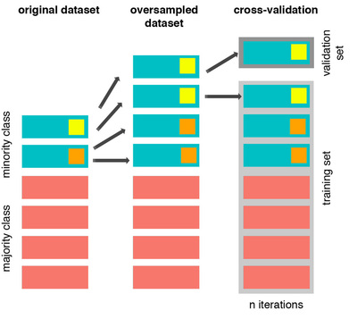

  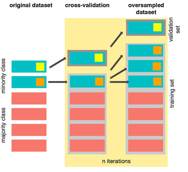

This is not a very good idea for data with many features. The larger the dimension space, the more complex it is for kNN to collect nearest neighbors. With 30 features, this approach was becoming tedious. I would have a hard time justifying synthetic samples for severely unbalanced classed when there are other machine learning techniques that are better suited to the actual problem at hand - anomaly detection.

## Anomaly Detection Techniques

### Isolation Forest

The first anomaly detection technique we will explore and evaluate is a Tree Based Ensemble Classifier, Isolation Forest.

Isolation Forest creates a esemble of random decison trees and grows the trees for the evaluated data. As a result of growing trees on normal and anomaly data. The trees are short and stubby for the anomaly instances as they reach their classification evaluation sooner than normal datapoints.

Overall, the model uses isolation rather than any profiling of normal instances or distance calculations. The short trees are aggregated as the anomaly class.

  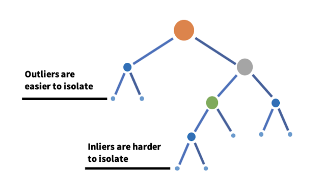

This model has a strong advantage as the model is able to exploit sampling techniques to an extent that is not allowed to the profile-based methods of classification. This means that the algorithm is quick and has low memory demand.

This model is relatively unchanged by most fine hyperparameter tuning as we are using it as a supervised classifer (we know which instances are fraud vs. normal because our original data is labeled). As such, tuning is best performed on the contamination score. The contamination score is the proportion of anomalies in the dataset, or as we know it as the original class proportions of the data. In practice, you want to have a contamination score higher generally than your actual % of the anomaly class. The reasoning is that you want to capture as much of your anomaly as possible. Recall your recall score! You want to recall as high as possible to ensure we indentify all of the true positives.

  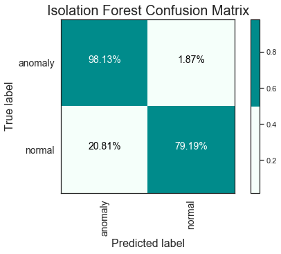

As we focus on the top left-hand corner at our True Positive rate and then at the top right-hand corner at our False Negative rate, these are the representation of our recall score. We want our True Positives to be as high as possible and our False Negatives as low as possible. Why again? False Negatives mean that you missed some instances of fraud. Not good!

We did pretty well here with a contamination rate of 2.0%, as 98.1% of fraud was identified. Though, we did have 1.8% of False Negatives, meaning we missed almost 2% of fraud instances. That's approaching dangerous territory...

Let's try another technique.

### PCA Anomaly Detection

PCA Anomaly Detection is the first of two dimensionality reduction algorithms that we will discuss. The second is Neural Network Autoencoding. Both of these methods are unsupervised learning. They do not need a labeled dataset and do not require target classifications to be able to classify or identify anomalies.

Principal Component Analysis is used to reduce the dimensionality of data and is often used to create latent features to help identify strong drivers of the data. When used for identifying anomalies or outliers, the idea is to try to capture the most salient information of the original features in such a way that they can reconstruct the original feature set from the reduced feature set as closely as possible. I will note here that PCA uses only linear decompression, Neural Networks handle non-linear compression methods.

We must note that when you compress data, you simply cannot capture all the information of the original features when smushed into a lower dimensional space. This means that there is always going to be some error as these algorithms reconstruct the reduced feature set back to the original number of dimensions. We can exploit that reconstruction error to identify anomalies.

Yes, we can say that the algorithm "failed" to reconstruct the original item, meaning that it found it too unique and weird to compress and reconstruction without much error. Upon reconstruction, we can compare the original datapoints with the compressed and reconstructed datapoints. The difference between the original and the reconstructed is the error. The higher the "reconstruction error" or "anomaly score" the more likely the datapoint is an anomaly our outlier. The 30 features were compressed down into 27 features. If we compress too much, we lose nuances in the data and we begin to classify normal datapoints as anomalies. I plotted this on 2 dimensions such that we can see the classes visually. 

  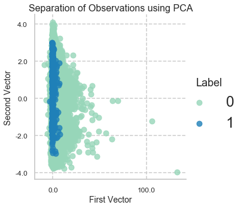

We must use domain knowledge or a fair amount of research to determine what the threshold is for a "high" reconstruction error. For this analysis, I chose a threshold of 0.022, meaning that any error above that, the original datapoint is classified into the anomaly class. As a result of this process, we resulted in a very high recall score with a lower False Negative rate than the Isolation Forest method.

  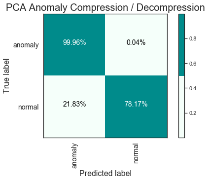

To be specific, the method identified 99.9% of the fraudulent transactions, which resulted in exactly 3 False Positives out of 394 Fraud transactions. Still a bit upsetting that we have some rate of False Negatives. These fraudelent transactions could be large in dollar value or especially criminal. I would prefer the business case to be that we have some minimal amounts of False Positives, normal transactions flagged as fraud. This would require some investigation and internal resource time, but would provide more risk coverage for customer exposure.

Let's see if our final method beats this already pretty impressive performance.

### Neural Network Autoencoding

Neural Network Autoencoding works similarly to PCA Anomaly Detection. Neural Networks function a little differently, in the sense that they use non-linear compression methods such as ReLU. NN Autoencoders are typically built on 3 layers, the input layer of the full 30 dimensions, one singular hidden layer that reduces the dimensions, and then an output layer that mirrors the original dimensions.

  

The 30 features were compressed down into 27 features again. For this analysis, I chose a a different reconstruction error threshold than the PCA method, this time I chose 0.0105, meaning that any error above that, the original datapoint is classified into the anomaly class. As a result of this process, we resulted in extremely similar results as the PCA Anomaly Detection.

  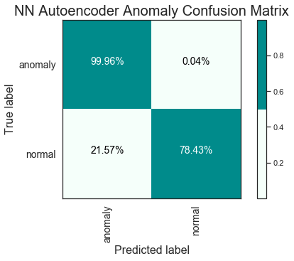

Comparing this method to how we assessed the PCA method, this NN method identified 99.9% of the fraudulent transactions, just like the PCA method. 

But, when we examine the specfic results, this time we resulted in exactly 3 False Negatives. This means that out of the 394 Fraud transactions, this method captured all of them during identification and falsely determined that 3 additional instances existed. This time, we reduced the rate of False Negatives.

For this analysis, the Neural Network Autoencoder performed best for our business case.

## Conclusion & Future Application

I am an exceedingly visual learner. I wanted to show the point by point view of the reconstruction error for the PCA and NN autoencoding analysis. 

  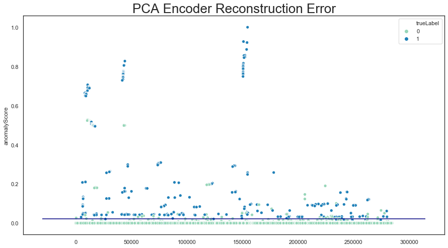

  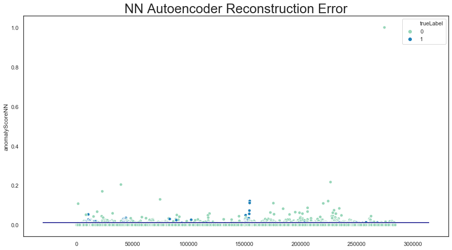

Wow, we can literally see the small errors that the PCA method had under the threshold line. Alternatively, we can see that the NN did not have any False Negatives, but did have a few False Positives (normal transactions above the threshold of error).

Throughout this analysis, we explored several methods to detect anomalies. We leveraged traditional classification using a variety of models, we considered oversampling, and we found pretty inspiring results using supervised tree-based classifiers. Ultimately, we found for this business case that autoencoders, PCA and Neural Networks were very useful tools.

In this field, there is usually someone who says it better, and in this case, I will just leave this quote here to convey my feelings about how we can use anomaly detection for a wide variety of problems.

>*... detection of anomalies allows extracting critical information from data which can then be used for a variety of applications, such as to stop malicious intruders, detect and repair faults in complex systems, and better understand the behavior of natural, social, and engineered systems.*- **Vipin Kumar, PhD Computer Science & author of Introduction to Data Mining**

### References

+ **[1]** FBI.gov, Scams and Safety, Common Scams and Crimes, 2019.
+ **[2]**  V. Chandola and V. Kumar, Outlier and Anomaly Detection Anomaly Detection: A Survey, ACM Computing Surveys, 2009.
+ **[3]** J. Brownlee, SMOTE for Imbalanced Classification with Python, Imbalanced Classification, January 2020.
+ **[4]**  E. Sharova, Unsupervised Anomaly Detection with Isolation Forest, PyData London Conference 2018.
+ **[5]**  A. A. Patel, Hands-On Unsupervised Learning Using Python, February 2019.
+ **[6]** C. Medford, Generative-Neural-Networks, February 2020.
